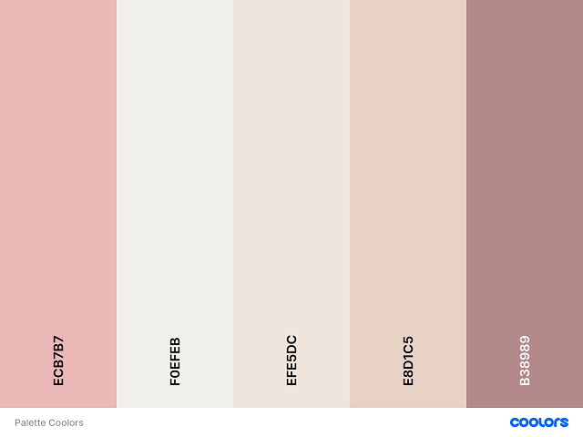

# Savour


Savour is a web app build to attract all categories of users that are interested in cooking, eager to learn new recipes and also be able to share their own recipe from different cuisine. 

[View live project here](https://savour-food.herokuapp.com/)

## Table of Contents

1. [UX](#ux)

    - [User stories](#user-stories)

    - [Strategy](#strategy)

    - [Scope](#scope)

    - [Structure](#structure)

    - [Skeleton](#skeleton)

    - [Surface](#surface) 

2. [Technologies Used](#technologies-used)

3. [Testing](#testing)

4. [Deployment](#deployment)

    - [Inception project](#inception-project)

    - [GitHub Pages](#github-pages)

    - [Local Clone](#local-clone)

5. [Credit](#credit)

6. [Disclaimer](#disclaimer)

[Back to Top](#table-of-contents)

-----

- ### UX:

  - #### User stories

    I.	First Time Visitor Goals:

    - To be able to quickly understand the purpose of the website. 

    - To be able to find recipe from different cuisine.

    - To be able to find recipe from different categories like: appetizer, breakfast, lunch etc.

    II.	Returning User Goals:

    - When I return to the website, I wanna be able to register to website.

    - I wanna be able to share my recipe thru the website to other users, by uploading my own recipes.

    - I wanna be able to edit/delete the recipes the was uploaded by me.

    III.	Site Owner Goals:

    - To be able to add, edit and delete my own recipes

    - To be able to add, edit and delete recipe categories.

    - Be able to receive feedback from user.

    - To promote my brand of cooking tools


 - #### Strategy

    - The website was build to those users who love to cook and are eager to learn and try new recipe. The website is designed with search functionality that allow users to search recipes from different category and with different keywords. In order to attract more users and keep them on the website users can register and share their own recipe as well with other users by create/edit/delete their recipe. The purpose of all functionality it's for the owner of website to promote his brand of kitchen tools.

    | Opportunity                                 | Importance | Viability / Feasibility |
    | :------------------------------------------ | :--------: | :---------------------: |
    | Home Page                                   |     5      |            5            |
    | Recipe Page - Search Recipes By Keywords    |     5      |            5            |
    | Shop Page                                   |     5      |            5            |
    | Register Page                               |     4      |            5            |
    | Login Page                                  |     4      |            5            |
    | Manage Recipe Category Page                 |     5      |            5            |
    | Create / Edit / Delete Recipes              |     5      |            4            |


[Back to Top](#table-of-contents)

-----
    
 - #### Scope

    Based on the strategy table all the feature were implemented in order to achieve user and owner goals

    - Home page - to quickly understand the purpose of the website

    - Recipe Page - where users can view all recipes

    - Shop Page - where the owner of website can promote his brand of kitchen tools

    - Register Page - where user can create an account on the website

    - Login Page - where user can login to the his profile to add/edit/delete recipes

    - Manage Recipe Category Page - where the admin can create/edit/ delete category

[Back to Top](#table-of-contents)

-----
    
  - #### Structure

    - ##### Features: 

        Responsive on all screen devices.

      - ##### Existing Features:
    
        1. Home Page 

            - The logo of Savour

            - Navigation bar - to help user navigate between the site pages: Categories, Recipes, Shop, Register, Login
            
            - Landing section - Where the user it's welcome with a hero image and welcome text.

            - Recipe section - Where the user can see three random recipes

            - Shop section - Where the user can see the kitchen tools

            - Footer - Where user can find links to site social media pages

        2. Recipe Page 

            - Landing section - Where user can see the recipe of the day 

            - Search field - Where user can search specific recipe

        3. Shop Page 

            - Where site owner promote a brand of cooking tools

        4. Register 

            - Where the user can create an account.

        5. Login Page 

            - Where the user can login in into their account

        6. 404 Page 

            - 404 Page - was added in case users redirect to a page that does not exist.
 
      - ##### Future Features to Implement:

        - Email Verification - Before registraion is complete 

        - Reset/Forget Password - Where user can recover their password

[Back to Top](#table-of-contents)

-----

- #### Skeleton

    -  Phone Wireframes: [Home](static/wireframes/phone/index-phone.png) [Recipes](static/wireframes/phone/all-recipes-phone.png) [Category](static/wireframes/phone/category-phone.png) [Contact](static/wireframes/phone/contact-phone.png) [Add Category](static/wireframes/phone/create-category-phone.png) [Add Recipe](static/wireframes/phone/create-recipe-phone.png) [Delete Category](static/wireframes/phone/delete-category-phone.png) [Delete Recipe](static/wireframes/phone/delete-recipe-phone.png) [Edit Category](static/wireframes/phone/edit-category-phone.png) [Edit Recipe](static/wireframes/phone/edit-recipe-phone.png) [Login](static/wireframes/phone/login-phone.png) [Manage Categories](static/wireframes/phone/manage-category-phone.png) [Profile Page](static/wireframes/phone/profile-phone.png) [Recipe Page](static/wireframes/phone/recipe-phone.png) [Register](static/wireframes/phone/register-phone.png) [Shop](static/wireframes/phone/shop-phone.png) 

    -  Tablet Wireframes: [Home](static/wireframes/tablet/index-tablet.png) [Recipes](static/wireframes/tablet/all-recipes-tablet.png) [Category](static/wireframes/tablet/category-tablet.png) [Contact](static/wireframes/tablet/contact-tablet.png) [Add Category](static/wireframes/tablet/create-category-tablet.png) [Add Recipe](static/wireframes/tablet/create-recipe-tablet.png) [Delete Category](static/wireframes/tablet/delete-category-tablet.png) [Delete Recipe](static/wireframes/tablet/delete-recipe-tablet.png) [Edit Category](static/wireframes/tablet/edit-category-tablet.png) [Edit Recipe](static/wireframes/tablet/edit-recipe-tablet.png) [Login](static/wireframes/tablet/login-tablet.png) [Manage Categories](static/wireframes/tablet/manage-category-tablet.png) [Profile Page](static/wireframes/tablet/profile-tablet.png) [Recipe Page](static/wireframes/tablet/recipe-tablet.png) [Register](static/wireframes/tablet/register-tablet.png) [Shop](static/wireframes/tablet/shop-tablet.png) 

    -  Desktop Wireframes: [Home](static/wireframes/desktop/index-page.png) [Recipes](static/wireframes/desktop/all-recipes-page.png) [Category](static/wireframes/desktop/category-page.png) [Contact](static/wireframes/desktop/contact-page.png) [Add Category](static/wireframes/desktop/create-category-page.png) [Add Recipe](static/wireframes/desktop/create-recipe-page.png) [Delete Category](static/wireframes/desktop/delete-category-page.png) [Delete Recipe](static/wireframes/desktop/delete-recipe-page.png) [Edit Category](static/wireframes/desktop/edit-category-page.png) [Edit Recipe](static/wireframes/desktop/edit-recipe-page.png) [Login](static/wireframes/desktop/login-page.png) [Manage Categories](static/wireframes/desktop/manage-category-page.png) [Profile Page](static/wireframes/desktop/profile-page.png) [Recipe Page](static/wireframes/desktop/recipe-page.png) [Register](static/wireframes/desktop/register-page.png) [Shop](static/wireframes/desktop/shop-page.png) 

[Back to Top](#table-of-contents)

-----

- #### Surface

    -  ##### Colour Scheme

        - Palette:

             

    -  ##### Typography

        - For this project I choose three types of Google Fonts: 'Crete Round', 'Lato' and 'Mr Dafoe'.

          For the consistency:

            - 'Mr Dafoe' fonts were used for the welcome text on landing page when user enters the site

            - 'Crete Round' fonts were used for the recipes and products title

            - 'Lato' fonts were used for the section titles and all other paragraphs within the page.

    -  ##### Imagery

        - Because imagery is important I have carefully chosen the background hero image on landing page, as well as all others banners within the site that will reflect the site and each page purpose.

[Back to Top](#table-of-contents)

-----

- ### Technologies Used

  - #### Languages:

    - [HTML5](https://en.wikipedia.org/wiki/HTML5) - used to structure website and its content.

    - [CSS3](https://en.wikipedia.org/wiki/CSS) - to format the contents of each webpage.

    - [JS](https://en.wikipedia.org/wiki/JavaScript) - for DOM manipulation.

    - [Pyhton3](https://www.python.org/) – to add functionalities to the server-side

    - [MongoDB Atlas](https://www.mongodb.com/) - for database

  - #### Frameworks, Libraries & Programs:

    - [Bootstrap](https://getbootstrap.com/) – CSS framework used to help with the navbar, cards, forms, modal and other classes that were used to make the app responsive.

    - [Google Fonts](https://fonts.google.com/) - to import the font-family used in the website: 'Crete Round', 'Lato' and 'Mr Dafoe'.

    - [Font Awesome](https://fontawesome.com/) - icons are a visual way to help add meaning to elements.

    - [GitHub](https://github.com/) - used to create and host the repository

    - [Git](https://git-scm.com/) - used for the version-control system for tracking changes in any set of files

    - [Gitpod](https://gitpod.io/) - IDE used to develop the project 

    - [Flask](https://flask.palletsprojects.com/en/1.1.x/) – Python micro web framework

    - [Jinja2](https://jinja.palletsprojects.com/en/2.11.x/) – Python template engine 

    - [PyMongo](https://pypi.org/project/pymongo/) to make communication between Python and MongoDB database

    - [PIP](https://pypi.org/project/pip/) for installation of tools needed in this project.

    - [JQuery](https://jquery.com/)


  - #### Additional tools:

    - [VS Code](https://code.visualstudio.com/) - IDE

    - [Autoprefixer CSS](https://autoprefixer.github.io/) - used to add prefix to css code

    - [Tinypng](https://tinypng.com/) - used to compress all image files in order to reduce loading time on each page

    - [HTML Validator](https://validator.w3.org/) - used to check HTML code for error

    - [CSS Validator](https://jigsaw.w3.org/css-validator/) - used to check CSS code for error

    - [JSHint](https://jshint.com/) - used to check JS code for error

    - [JSDoc](https://jsdoc.app/) - document the JavaScript code with JSDoc

    - [PEP8 Validator](http://pep8online.com/) - was used to validate Python

    - [I Am Responsive](http://ami.responsivedesign.is/) - for the main image in Readme to show responsive to different screen size

    - [Balsamiq](https://balsamiq.com/) - used to make the wireframes for the project

    - [Coolors](https://coolors.co/) - used for color palette

    - [Adobe Photoshop 2020](https://www.adobe.com/ie/products/photoshop.html?gclid=Cj0KCQjwrsGCBhD1ARIsALILBYpcZ9gNDfvVo1tJUaPzX_D5Bbo7kr6tDseIjZmjRTGbiBTqIURjULAaAvGnEALw_wcB&mv=search&sdid=LZ32SYVR&ef_id=Cj0KCQjwrsGCBhD1ARIsALILBYpcZ9gNDfvVo1tJUaPzX_D5Bbo7kr6tDseIjZmjRTGbiBTqIURjULAaAvGnEALw_wcB:G:s&s_kwcid=AL!3085!3!441664403997!b!!g!!%2Bphotoshop!1423510553!55397634865) - used to create the savour logo (all rights reserved) and favicon for this project

[Back to Top](#table-of-contents)

-----

- ### Testing

    - Testing documentation can be found [HERE](TESTING.md)

 [Back to Top](#table-of-contents)

-----

- ### Deployment

  - #### Inception project 

    1. This project was created from the Code Institute project template from [here](https://github.com/Code-Institute-Org/gitpod-full-template) on Github by clicking on "Use this template"

        

    2. Once the project was created I rename it from the settings 

        

    3. When the repository was finally completed I open the project with [Gitpod](https://chrome.google.com/webstore/detail/gitpod-dev-environments-i/dodmmooeoklaejobgleioelladacbeki?hl=en) in Chrome browser

    4. In order to push this project from Gitpod on Github a set of commands were used:

        ```
        - git status  - Check the status of the repository and see if there were any changes in files 

        - git add .  - Add the files that were modified/created, so we can commit it 

        - git commit -m "message for commit"  - Commits all the changes

        - git push  - Pushes all committed versions to Github
        ```

  - #### Heroku

    - The project was deployed to Heroku using the following steps:

        1. Create ```requirements.txt``` file that contains a list of our Python dependencies by typing in the terminal 
        
            ```
            pip3 freeze --local > requirements.txt
            ```

        2. Create ```Procfile``` file that tells Heroku how to run our project by typing in the terminal

            ```
            echo web: python run.py > Procfile
            ```

        3. Push the ```requirements.txt``` and ```Procfile``` file to github with the following commands

            ```
            git add -A

            git commit -m

            git push
            ```

        4. In order to deploy to Heroku you need an [account](https://signup.heroku.com/login?redirect-url=https%3A%2F%2Fid.heroku.com%2Foauth%2Fauthorize%3Fclient_id%3Dd2ef2b24-e72c-4adf-8506-28db2218547d%26response_type%3Dcode%26scope%3Dglobal%252Cplatform%26state%3DSFMyNTY.g2gDbQAAADFodHRwczovL2Rhc2hib2FyZC5oZXJva3UuY29tL2F1dGgvaGVyb2t1L2NhbGxiYWNrbgYAnwF4L3kBYgABUYA.q2PQc0k53ICJ0LR6VFKbOkyuEqmEtG0iuVzTM38UNAI)

        5. Now you can create an new app from the dashboard ````New``` Menu

        

        6. Now you need to set up a name and select a region closest to you

            NOTE: Remember the name has to be unique and generally use a dash and lowercase letters

        6. From the dashboard of your app click on the settings and go to Reveal Config variables

        

        7. Set up the Config Vars 

            | Key             | Value                                                                                                       |
            | :---------------| :---------------------------------------------------------------------------------------------------------: |
            | IP              | 0.0.0.0                                                                                                     |
            | MONGO_DBNAME    | <your_database>                                                                                             |
            | MONGO_URI       | mongodb+srv://<user>:<password>@<your_cluster>.ol3x3.mongodb.net/<yourdatabase>?retryWrites=true&w=majority |
            | PORT            | 5000                                                                                                        |
            | SECRET_KEY      | <your_secret_key>                                                                                           |      

        8. Hide the Config Vars

        9. Now from the dashboard of your app click on the Deploy and from Deployment method select ```Github - Connect to Github```. Next on the search field type the name of the repository you want to deploy.
        
        

        10. Once it finds your repository click ```Connect``` 

        11. Next you can click ```Enable Automatic Deploys```

        

        12. Now From Manual Deploy you can click ```Deploy Branch``` and once it's finish you can click ```View```

         

  - #### Local Clone

    ##### In oder to run this project locally you should have installed this 3 requirements on your machine plus an account on [MongoDB Atlas](https://www.mongodb.com/):

    1. [VS Code](https://code.visualstudio.com/) - IDE or your personal preference

    2. [Pyhton3](https://www.python.org/) - to run the application on your local machine

    3. [PIP](https://pypi.org/project/pip/) for installation of tools needed in this project.

    Now you can create an account on [MongoDB Atlas](https://www.mongodb.com/) and follow the steps from [here](https://docs.atlas.mongodb.com/getting-started/). The MongoDB collection for this project can be found [here](static/savour_collections)
    
    Optional: you can install [Git](https://git-scm.com/)

    ##### Steps to follow

    1. At the top of the repository click on Code and click on download zip and extracting the zip file to your chosen folder or keep the same name

        

    Optional: if you have [Git](https://git-scm.com/) install on your machine you can type

    ```
    git clone https://github.com/constantinadrian/savour
    ```

    or to clone the repository into different name on the folder you can run 

    ```
    git clone https://github.com/constantinadrian/savour folder_name
    ```

    more info about cloning with git [here](https://git-scm.com/book/en/v2/Git-Basics-Getting-a-Git-Repository).

    2. Create a virtual environment within the project directory to keep dependencies required by the project separate from other projects by creating an isolated Python virtual environment.

    ```
    py -3 -m venv venv
    ```

    3. Activate the environment

    ```
    venv\Scripts\activate
    ```

    NOTE: If you run on Linux/maxOS more info for step 2 and 3 [here](https://flask.palletsprojects.com/en/2.0.x/installation/) 

    4. Install all dependencies from requirements.txt:

    ```
    pip3 install -r requirements.txt
    ```

    Note: For upgrade PIP type this command ```pip3 install --upgrade pip```

    5. Declare default environment variables in a file ```env.py``` 

    ```
    import os

    os.environ.setdefault("SECRET_KEY", "your_secret_key")
    os.environ.setdefault(
        "MONGO_URI", "mongodb+srv://<user>:<password>@<your_cluster>.ol3x3.mongodb.net/<yourdatabase>?retryWrites=true&w=majority")   
    os.environ.setdefault("MONGO_DBNAME", "<yourdatabase>")
    ```
    6. Add ```env.py``` to your ```.gitignore``` file.

    7. To run the project run 
    ```
    flask run
    ```

    NOTE: to run the project with ```py app.py``` on the ```app.py``` file change the code from line 1068 to

    ```
    if __name__ == "__main__":
        app.run()
    ``` 

    8. Now you can visit the website at http://127.0.0.1:5000

[Back to Top](#table-of-contents)

-----

- ### Credit

  - #### Code

    - Code for function sendMail was adapted from Full Stack Development Course - Interactive Frontend Development - Resume Project at [Code Institute](https://codeinstitute.net/)

    - [SweetAlert2](https://sweetalert2.github.io/#download) - for box alert hat was used on the contact form as a response generated on user action when the form is submitted

    - [Bootstrap](https://getbootstrap.com/) – CSS framework used to help with the navbar, cards, forms, modal and other classes that were used to make the app responsive.

    - [Bootstrap Modal JS](https://getbootstrap.com/docs/4.6/components/modal/) - Code snipet adapted for update the modal content with information that has to be edited / deleted

    - [Favicon](https://favicon.io/favicon-converter/) - for the code for use in this project; the favicon was created by the developer and saved in all sizes that were needed

    - Pagination was inspired from this two website and modified and adapted to my understanding on my project

        - [https://gist.github.com/mozillazg/69fb40067ae6d80386e10e105e6803c9](https://gist.github.com/mozillazg/69fb40067ae6d80386e10e105e6803c9) 

        - [https://harishvc.com/2015/04/15/pagination-flask-mongodb/](https://harishvc.com/2015/04/15/pagination-flask-mongodb/)
    
    - [Decorate routes to require login](https://flask.palletsprojects.com/en/1.1.x/patterns/viewdecorators/) - function adapted and used for user authentication in my project

    - [bson.errors.InvalidId](https://www.programcreek.com/python/example/87925/bson.errors.InvalidId) - used to check the ObjectId of each recipe/category before edit or delete

    - [https://jqueryvalidation.org/documentation/](https://jqueryvalidation.org/documentation/) - used for validation on Frontend

    - [w3schools](https://www.w3schools.com/jsref/event_onerror.asp) - used if an error occurs when loading an image

    - [MDN Web Docs](https://developer.mozilla.org/en-US/docs/Web/API/Touch_events) - for touch events on IOS as the navbar didn't close on click event on IOS when the click was on document. Also used MDN Web Docs for general info

    - [Jinja Docs](https://jinja.palletsprojects.com/en/3.0.x/templates/#import) - for import and general info

    - [Email Regex](https://emailregex.com/) - used as pattern for validate email address

  - #### Content

    - [Taste Life](https://www.tasteshow.com/) - used as general inspiration

    - [Great British Chefs](https://www.greatbritishchefs.com/) - used as general inspiration

    - All Recipes uploaded on this project by admin were taken from [Great British Chefs](https://www.greatbritishchefs.com/) and they own the copyright

  - #### Media

    - All photos used on this project as hero image, banners, default banner and default recipe image were from:

        - [Pexels](https://www.pexels.com/)

        - [Pixabay](https://pixabay.com/)

  - #### Acknowledgements

    - [Code Institute](https://codeinstitute.net/) for all course material 

    - Slack community

    - My mentor Oluwafemi Medale for his support and feedback that he has given me for this milestone project.

[Back to Top](#table-of-contents)

-----

- ### Disclaimer

  - This project is for educational purposes only.
