# Testing

## Table of Contents

1. [Code Validation](#code-validation)

    - [HTML](#html)

    - [CSS](#css)

    - [JS](#js)

    - [PEP8](#pep8)

2. [Browser compatibility and responsiveness](#browser-compatibility-and-responsiveness)

    - [Testing on Different Browsers](#testing-on-different-browsers)

    - [Testing on Different Devices](#testing-on-different-devices)

3. [Testing User Stories](#testing-user-stories)

4. [Manual testing](#manual-testing)

5. [Bugs and Fixes](#bugs-and-fixes)

-----

- ### Code Validation  

    - #### HTML 
    
        HTML checked was done with [The W3C Markup Validation Service](https://validator.w3.org/)
        
         - All Pages 
         
            

    - #### CSS 
    
        CSS checked was done with [The W3C CSS Validation Service](https://jigsaw.w3.org/css-validator/)
    
        - CSS - style.css
        
            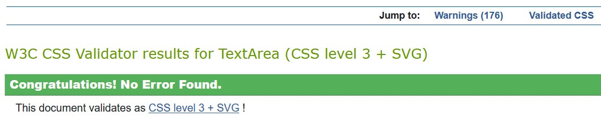

            - The warnings were for:

                The value break-word is deprecated.

                Same color for background-color and border-color on pagination links

                And the rest for unknown vendor extension

        - CSS - recipe.css

            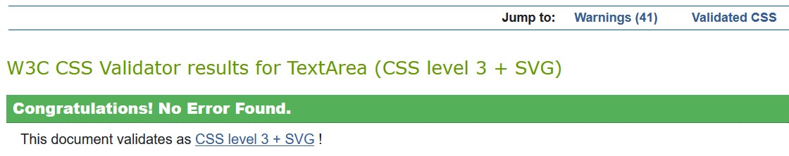

            - The warnings were for:

                The value break-word is deprecated.

                And the rest for unknown vendor extension

        - CSS - forms.css

            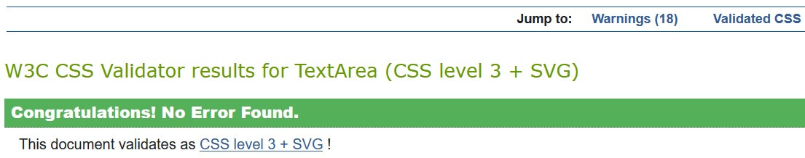

            - The warnings were for:

                The value break-word is deprecated.

                And the rest for unknown vendor extension
        

    - #### JS 
    
        JS checked was done with [JSHint, a JavaScript Code Quality Tool](https://jshint.com/)

        - script.js

            - 21 warnings: 
                
                'let' is available in ES6 (use 'esversion: 6') or Mozilla JS extensions (use moz). 

            - Unused variable:

                $ - jquery function.

        - recipe.js

            - 15 warnings:

                'let' is available in ES6 (use 'esversion: 6') or Mozilla JS extensions (use moz). 

                'template literal syntax' is only available in ES6 (use 'esversion: 6').

            - Unused variable:

                $ - jquery function.

        - jquery_validate_forms.js

            - 30 warnings:

                'let' is available in ES6 (use 'esversion: 6') or Mozilla JS extensions (use moz). 

                'computed property names' is only available in ES6 (use 'esversion: 6').

            - Unused variable:

                $ - jquery function.

                sendMail - function that it's call with onsubmit attribute when the contact form is submitted with emailjs

        - emailjs.js

            - The three undefined variable are:

                emailJS - is a service that allows us to send emails directly from your client-side JavaScript code.

                $ - jquery function.

                Swal - sweetalert2 library that acts as a replacement for the JavaScript’s alert() function.

            - Unused variable:

                sendMail - function that it's call with onsubmit attribute when the contact form is submitted with emailjs

        - add_recipe.js

            - 21 warnings

                'let' is available in ES6 (use 'esversion: 6') or Mozilla JS extensions (use moz). 

                'const' is available in ES6 (use 'esversion: 6') or Mozilla JS extensions (use moz).

                'template literal syntax' is only available in ES6 (use 'esversion: 6').

                Missing semicolon

            - Unused variable:

                $ - jquery function.

    - #### PEP8 
    
        [PEP8 Validator](http://pep8online.com/) was used to validate Python code

        - app.py - All right

        - helpers.py - All right

[Back to Top](#table-of-contents)

-----
       
- ### Browser compatibility and responsiveness

  - #### Testing on Different Browsers

    - The following web browsers were used for testing the browser compatibility and responsiveness (System: Windows 10 64-bit).

        1. Chrome - Version 89.0.4389.90 (Official Build) (64-bit)

        2. Firefox - 87.0 (64-bit)

        3. Edge - Version 89.0.774.57 (Official build) (64-bit)

        4. Opera - Version:74.0.3911.232

        All test was good. 

        Note: No test was performed for Internet Explorer.

  - #### Testing on Different Devices

    1. iPhone 11 - IOS 14.0.1

    2. Ipad Mini 2 - IOS 12.4.8 

    3. Huawei P Smart

    4. iPhone 5S - IOS 10.2.1

    All test was good with some exceptions from IOS (see Bugs and Fixes).

  - A large amount of testing was done to ensure that all pages were linked correctly.

[Back to Top](#table-of-contents)

-----

- ### Testing User Stories

    I. First Time Visitor Goals

    - To be able to quickly understand the purpose of the website. 

        - When the user enters the site he can easily understand the purpose of the website from the hero image, the welcome text, and the easy-to-read-navigation menu 

    - To be able to search recipes uploaded by other users

        - On the Recipes Page / Search Page the users can search any recipes uploaded by each user

    - To be able to find recipes from different categories like appetizer, breakfast, lunch, etc.

        - On the Recipes Page / Search Page users can search recipes from different categories

        - On the Category Page users can search recipes within the specific category

    II.	Returning User Goals:

    - When I return to the website, I wanna be able to register to the website.

        - The app was built with the register/login functionality 

    - I wanna be able to share my recipe thru the website to other users, by uploading my own recipes.
    
        - After register on the navigation page the user can use the link to "Add recipe page" and on the profile page, the user has a button that will take him to the "Add recipe page" 

    - I wanna be able to edit/delete the recipes the was uploaded by me.  

        - When a user is a login and access his recipes from the profile page/recipes page/category page all individual recipes will display an "Edit" link on the top left side of the recipe

    III. Site Owner Goals:

    - To be able to add, edit and delete my own recipes

        - The site owner, as well as the users, can add, edit or delete his own recipes

    - To be able to add, edit and delete recipe categories.

        - The site owner is the only one that can add, edit or delete recipe categories.

    - Be able to receive feedback from users.

        - The owner of the website can receive any message/feedback from registered users or first-time users thru the contact form 

    - To promote my brand of cooking tools

        - The purpose of the website it's for the owner to promote his brand of kitchen tools.

[Back to Top](#table-of-contents)

-----

- ### Manual testing

    - Testing all links from the navigation bar

        - Expected: Once each link is pressed it has to redirect to each specific page. Logo to redirect the home page.

        - Result: All links were working correctly.

    - Testing all links from home page sections

        - Expected: Once the title Recipes/Shop section link is pressed or the link under each section for ```More Recipes```/```More Products``` is pressed it has to redirect to each specific page. 

        - Result: All links were working correctly.

    - Testing card links from the Recipes section from each page

        - Expected: Once each card link is pressed it has to redirect to each specific recipe page. 

        - Result: All links were working correctly.

    - Testing card links from the Shop section from each page

        - Expected: Once each card link is pressed it has to open a modal which will inform the user of the status of our shop page. 

        - Result: All links were working correctly.

        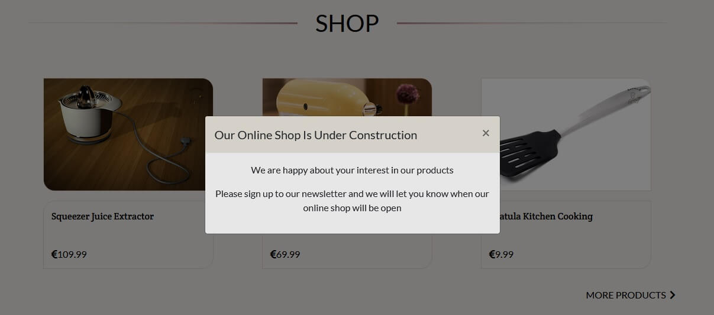


    - Testing SIGN UP TO OUR NEWSLETTER from each page

        1. Expected: If the user pressed ```Subscribe Now``` and the form is empty display the required message to the user.
          
            - Testing: Submitted empty form

            - Result: As expected the message it's shown    

                  

        2. Expected: If the user pressed ```Subscribe Now``` and the email is not a valid email display the required message to the user (See Credit Code to validate the email address).

            - Testing: Submitted invalid email

            - Result: As expected the message it's shown

            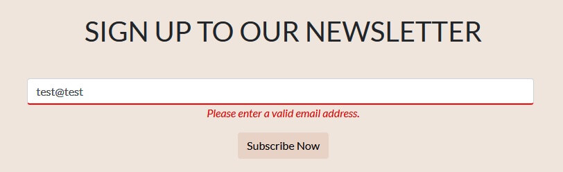

        3. Expected: If the user pressed ```Subscribe Now``` and the email was not previously Subscribed display a success message to the user.

            - Testing: Submitted ```test@yahoo.com``` email

            - Result: As expected the message it's shown

                    
        
        4. Expected: If the user pressed ```Subscribe Now``` and the email was previously Subscribed display denied message to the user
        
            - Testing: Submitted ```test@yahoo.com``` email

            - Result: As expected the message it's shown

            
        
        5. Expected: If the user pressed ```Subscribe Now``` and we get an error on subscribe display the error message to the user.

            - Testing: Disconnected the internet and submitted ```test@yahoo.com``` email

            - Result: As Expected everything was working correctly.

            

        6. Expected: if the user pressed the contact us link from subscribing error message redirects to the Contact page.

            - Testing: Press the link from the displayed message

            - Result: As Expected the user's redirecting to the Contact page.
    
    - Testing all links from the footer page

        - Expected: Once each link is pressed it has to redirect to each specific page. Logo to redirect the home page.

        - Result: All links were working correctly.

    - Testing all links from the recipe page

        1. Expected: If the user pressed Category ``` Appetizer``` it has to redirect to a specific page.
          
            - Testing: Press the category link

            - Result: As Expected the user's redirecting to the category Appetizer Page.    

        2. Expected: If the user pressed By ```user``` it has to redirect to a specific page for each user to view their recipes.

            - Testing: Press By ```user``` link

            - Result: As Expected the user's redirecting to a specific page to each user to view their recipes.

        3. Expected: If the user pressed ```Rate``` it has to redirect to the rating section on the page

            - Testing: Press ```Rate``` link

            - Result: As Expected the user's redirecting to the rating section on the page    
    
        4. Expected: If the user pressed any ```Rating Stars``` and if the user is not logged in displayed reject message
        
            - Testing: Press the Rating star as a quest

            - Result: As expected the reject message it's shown

            

        5. Expected: The links ```Login``` and ```Register``` from Rating star reject message to redirect each on their own page
        
            - Testing: Press each link from the Rating star reject message

            - Result: As expected the links redirect on their own page
        
        6. Expected: If the owner of the recipe pressed any ```Rating Stars``` display denied message
        
            - Testing: Log in and pressed ```Rating Stars``` on the recipe added by the user

            - Result: As expected the denied message it's shown

            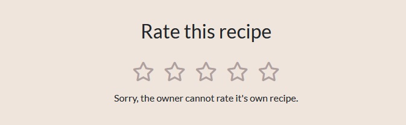

        7. Expected: If user rate other recipes after he logged in displayed success message and update rate stars on the description of the recipe
        
            - Testing: Log in and pressed ```Rating Stars``` on the recipe added by other users

            - Result: As expected the success message it's shown and rate stars on the recipe description are updated

            

            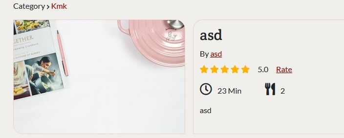

        8. Expected: If the user rate other recipes after he logged in and an error occurred displayed the error message
        
            - Testing: Disconnected the internet and pressed ```Rating Stars```

            - Result: As expected the error message it's shown

            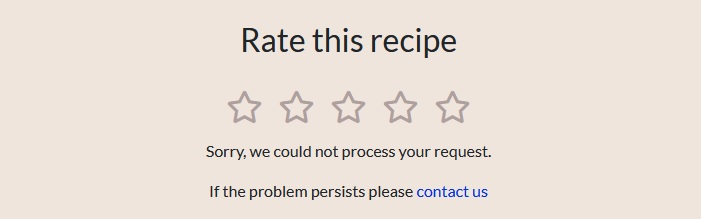
            
        9. Expected: if the user pressed the contact us link from the rating error message redirects to the Contact page.

        - Testing: Press the link from the displayed message

        - Result: As Expected the user's redirecting to the Contact page.

    - Pagination on each page

        1. Expected: if the user tries to access a page that does exist display the ``` No Results Found``` message.

            - Testing: On the URL we added a page that does not exist savour-food.herokuapp.com/category/mains```?page=15```

            - Result: As expected the ``` No Results Found``` message is displayed.

            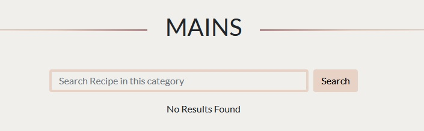

        2. Expected if the user wants less or more item ```per_page``` he can change/add the number of items on URL and the number of items should change accordingly

            - Testing: On the URL we added/change the ```per_page``` items: savour-food.herokuapp.com/all_recipes?page=1```&per_page=1```

            - Result: As expected the number of items per page change and the pagination increases

        3. Expected if the user input for ``` page``` and ```per_page``` is a positive integer greater than ```0``` redirect the user to 404 Page

            - Testing: On the URL we added/change the ```page``` number: savour-food.herokuapp.com/all_recipes?page=```0```&per_page=1

            - Testing: On the URL we added/change the ```page``` number: savour-food.herokuapp.com/all_recipes?page=```-1```&per_page=1

            - Testing: On the URL we added/change the ```per_page``` items: savour-food.herokuapp.com/all_recipes?page=0&per_page=```f```

            - Result: As expected the user is redirected in each case on the 404 Not Found page 

    - Register page

        1. Expected: If the user register with a username and an email that already have been used for another registration denied the user register to the website and show a flash message
          
            - Testing: Register the same user by using the same username and email

            - Result: As Expected the user it's shown a flash message with ```Username and email already in use```.

        2. Expected: If the user register with a username or email that already have been used for another registration denied the user register to the website and show a flash message
          
            - Testing: Register the user by using a username or email that have been used before

            - Result: As Expected the user it's shown a flash message with ``` Username already in use ``` for an already register username and ```Email already in use``` for an already register email.

        3. Expected: If the user register with a new username and a new email login user, redirect to the profile page and show a flash message
          
            - Testing: Register the user with a username and email that have not been used before

            - Result: As Expected the user it's logged in, redirects to the profile page and it's shown a flash message with ```Registration Successful!```.

    - Login

        1. Expected: If the user types an email that was not used for registration display the error flash message
          
            - Testing: Used an email that was not registered before and press login

            - Result: As Expected the user it's shown a flash message with ```Incorrect Email and/or Password ```.

        2. Expected: If the user types a wrong password but the email is valid display the error flash message
          
            - Testing: Used a registered email and type a random password

            - Result: As Expected the user it's shown a flash message with ```Incorrect Email and/or Password ```.

    - Logout

        - Expected: When the user press the ```Logout``` remove the user from the session, redirect to the Login page and show a flash message
            
        - Testing: Press Logout on the navigation bar after I log in with the random user

        - Result: As Expected the user it's logged in, redirects to the profile page and it's shown a flash message with ```You have been logged out```. 

    - Add Recipe Page

        1. Expected: User cannot submit the form without completing all fields (fields created dynamically also)

            - Testing: Submitted empty form

            - Result: As expected the form could not be submitted and all the fields are displaying the error messages

        2. Expected: User can add dynamic fields for Ingredients and Methods after what element they want

            - Testing: After creating the first dynamic field I click the ``` Add item``` button on the default(first) field

            - Result: As expected between the two fields another field was inserted. 

        3. Expected: User can remove dynamic fields for Ingredients and Methods after what element they want

            - Testing: After created multiple fields dynamically I click the ```Remove item``` button on the field between two fields

            - Result: As expected the field was removed between the two fields 

    - Edit Recipe Page

        1. Expected: If the User wants to delete a recipe prompt the user for a confirmation

            - Testing: Pressed ```Delete``` button from the edit recipe page

            - Result: As expected the user is prompted with a message if he wants to proceed with deleting the recipe
        
        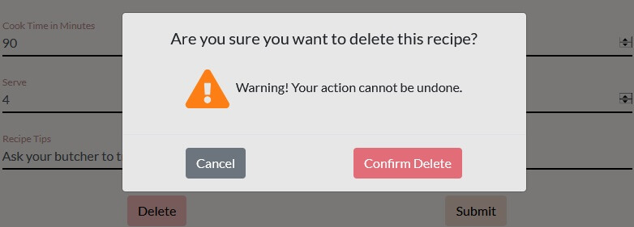

        2. Expected: If the user wants to edit a recipe after submitting the edited recipe it redirects to the recipe page and changes should be seen immediately

            - Testing: After login from the profile page open a recipe and press the ``` Edit``` button from the edit recipe page and made changes to the recipe and Submitted

            - Result: As expected after submitting the recipe the changes were seen immediately

    - Manage Categories Page (admin only)

        1. Expected: If Admin wants to delete a category he is prompted for a confirmation

            - Testing: Pressed ```Delete``` button from category card

            - Result: As expected the Admin is prompted with a message if he wants to proceed with deleting the category

        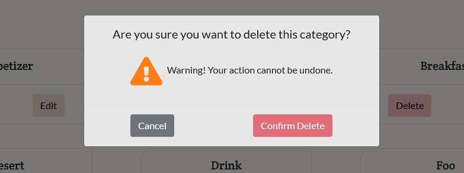

        2. Expected: If the category that needs to be deleted has one or more recipes we revoke the deleting and show a flash message to Admin

            - Testing: Pressed ```Delete``` button on a category that has one/more recipe and ```Confirm Delete```

            - Result: As expected on the Manage Categories Page the Admin get a flash message that a specific category cannot be deleted

        3. Expected: If Admin wants to add a category that already exists we show a flash message with the text ``` Category Already Exists```  

            - Testing: Pressed ``` Add Category``` button on the Manage Categories Page and add an existing category

            - Result: As expected on the Manage Categories Page the Admin get a flash message that a specific category already exists

        4. Expected: If Admin wants to edit the name to a category and he submits the same category or a category that already exist we show a flash message with the text ``` Category Already Exists```  

            - Testing: Pressed ```Edit``` button on a category card and change the name to an existing category

            - Result: As expected on the Manage Categories Page the Admin get a flash message that a specific category already exists
    
    - Contact Page

        - Success

            - Expected: After the user fills the contact form and press submit if the response from emailjs is successful display the success message

            - Result: The message is displayed as expected.

        - Error

            - Expected: If the user message could not send an error message will be shown to the user.

            - Testing: Disconnected the internet, fill in the contact form, and submit it.

            - Result: The error message is displayed as expected.

    - 401 page

        - Expected: if the user tries to access his profile page without being logged in redirect to the 401 Authorization required page.

        - Testing: Without being logged in try to access the URL: savour-food.herokuapp.com/```profile/someuser```

        - Result: The user's redirecting to 401 Authorization required page.

    - 403 page

        - Expected: if the user tries to access other profile pages (admin page) after being logged in redirect to the 403 Access Denied / Forbidden page.

        - Testing: After being logged in try to access the URL: savour-food.herokuapp.com/```profile/differentuser```

        - Result: The user's redirecting to 403 Access Denied / Forbidden page.

    - 404 page

        - Expected: if the user redirects to a page that does not exist a custom 404 page will display a message with a button to redirect to the home page.

        - Testing: Different page was trying to access from URL 

        - Result: The user's redirecting to 404 Not Found page.

[Back to Top](#table-of-contents)

-----

- ### Bugs and Fixes

    - After login users can access the profile of other users

        - To fix: I block access of each user viewing the other profile I added a check and if a user is not in session["user"] will be redirected to 403 Denied/Forbidden Page

        ```
        if username != session["user"]:
            return redirect(url_for('error', code=403))
        ``` 

    - If the user alters the recipe id when trying to view/edit/delete the recipe the app crashes with the following error

        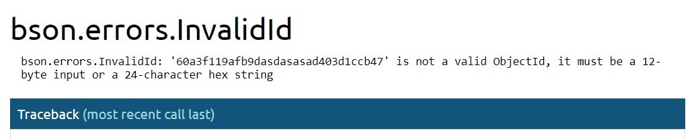

        - To fix: I added a function to check the ObjectId if is valid or not (See Credit Code)

    - If the admin decided to Delete a category the specific category was deleted automatic but was creating an issue if the category was having one or more recipes
    
        - To fix: a query was made on recipes collection to count how many recipes the specific category has. If the return was one or more we revoke the delete command and show a message to the admin. 

    - If the admin decided to edit a category already in use the category was updated but now we couldn't access the recipes from the old category on the Recipes drop-menu on the navbar

        - To fix: I update the old category with a different query using "find_one_and_update" and return the old document. After returning the old document made a second query and update the category on each recipe that was in the specific category

    - Required attribute not working on Safari (IOS) and when the user submitted an empty form on add recipe an error occurred

        

        - To fix: I added jquery validation on the client-side to stop the user from submitting an empty form and I added a check on the server-side to check if the user fills each field

    - jQuery validation error messages not working properly on fields created dynamically

        - This was happening because all the ingredients/steps fields created dynamically were having the same name attribute

        - To fix: I made each name unique by adding a number at the end of each name

    - On Safari (IOS) the collapse menu is not closing when click/touch outside the navbar

        - To fix: I added touch event "touchstart" and was working after that

    - When click on shop items and the modal displays the item card had a blue outline border on IOS devices only

        - To fix: add new rule on css "outline: 0 !important;"

    - Pagination for Search Page not displaying properly when accessing the second page 

        - To fix: change the form method from POST to GET and everything was working fine

    - On small screen size the width for display cards were not the same

        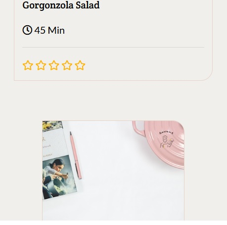

        - To fix: added width of 100% on cards and change the width of card parent for different screen size

    - All fields created dynamically had a different message when displaying the required error message compared to the first field

        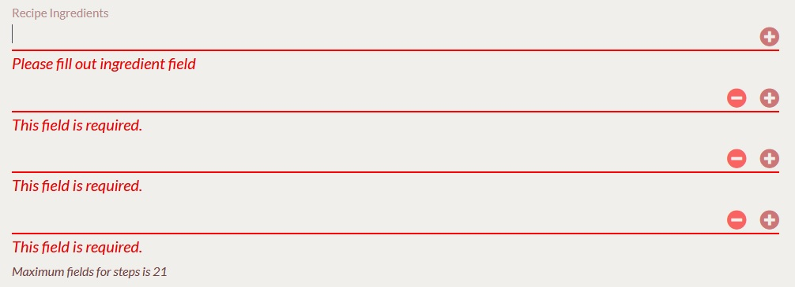

        - To fix added data attribute from javascript for each field when is created dynamically

Return to [README.md](README.md)